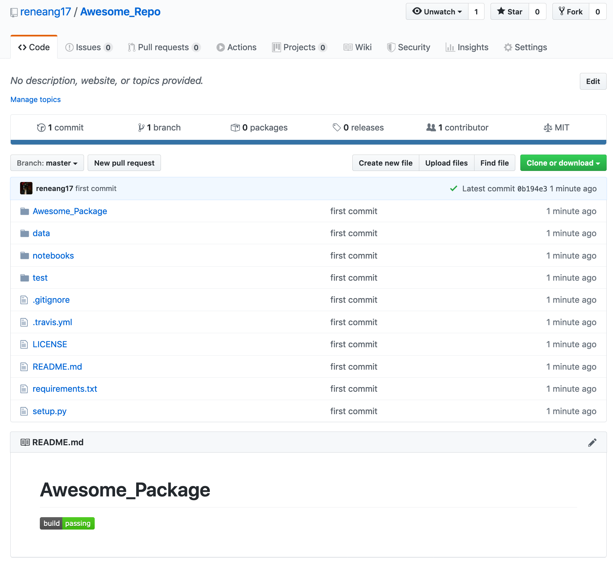

# Giter

My friend [Tom McClintock](https://github.com/tmcclintock) gave me a seminar on his awesome [first 10 commits](https://docs.google.com/presentation/d/1rJyTpUZPaCXiz43ZHQmCiq-1rEsflbFS8aCv7bgBl7Q/edit?usp=sharing) to start a new data-oriented project using best practices. This is a script I wrote to authomate these commits so you can jump straight to your project. Future improvements will include some data cleaning libraries and some basic exploratory data analysis, for structured and un-structured data.

Succinctly, clone this repo and run `_git_starter.py` to initialize a project with a MIT Licence, `REAME.md`, `notebooks` directory, `.gitignore`, a source directory, installation files (e.g. `setup.py`, `requirements.txt`), create a unit test directory with initial tests (smoke tests), and add [travis-CI](https://travis-ci.com/) support.

Enjoy!

## How to use

0. (Only once) Fork and clone this repo to your local computer, 
open _git_starter.py, customize the following settings

```python
git_username = 'your_github_username'

travis_user = 'your_travis_username'

author = 'your_name'

author_email = 'your_email'
```

Then simply add, commit, and push to your repository.

Every time you want to start a new project follow the next steps

1. Create a repository e.g. https://<span></span>github.com/git_username/git_repo_name

2. (Optional) Tell [travis to track the repository](https://travis-ci.com/account/repositories)

3. Clone giter `git cone https://github.com/your_github_username/giter`

4. Finally run `_git_starter.py` parsing the following arguments

| Parameter       | Description                       | Default |
| -------------   | -------------                     | ------------- |
| --git_repo_name | Repo name to commit to            | No default |
| --package_name  | The name you want for you package | No default | 
| --add_travis    | Add .yml                          | True |
| --add_template  | add notebooks and data dirs       | True |

e.g.

```bash
$python _git_starter.py --git_repo_name Awesome_Repo --package_name Awesome_Package
```

Voilà! You can go to https://<span></span>github.com/git_username/git_repo_name and will find something like this:



